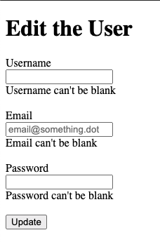

# Building Forms with Ruby on Rails

> In these project we worked to implement authentication systems so users can only access areas of a site they are authorized to.

> In this project we:

- Generated the model/controller/migrations for User
- Build a User form the old fashioned way and then the Rails way.
- Validate input data from form new/edit User form.

## Features

- Create User
- Edit User
- Form inputs validation

## Built With

- ruby '2.7.1'
- 'rails', '~> 6.0.3', '>= 6.0.3.2'
- 'sqlite3', '~> 1.4'

## Getting Started

​To have a version on your local machine:

- Clone this repository
- Open a terminal on the containing folder of this project
- Run 'bundle install' to install the dependences
- Set the database using the command 'bin/rake db:migrate'
- Run the server using the command 'rails server'

- To create a User open http://localhost:3000/users/new in your browser and submit the form
- To edit a User open http://localhost:3000/users/{user_id}/edit in your browser and submit the form
- To list your Users data you can use the command in your terminal

> rails console
> User.all

## Authors

👤 **Marilena Roque**

- Github: [MarilenaRoque](https://github.com/MarilenaRoque)
- Twitter: [@MariRoq88285995](https://twitter.com/MariRoq88285995)
- Linkedin: [roquemarilena](https://www.linkedin.com/in/roquemarilena/)

👤 **Emanuel González**

- Github: [@emasdev](https://github.com/emasdev)
- Twitter: [@elemasss](https://twitter.com/elemass)
- Linkedin: [@emasdev](https://www.linkedin.com/in/emasdev/)

## 🤝 Contributing

Contributions, issues and feature requests are welcome!

Feel free to check the [issues page](issues/).

## Show your support

Give a ⭐️ if you like this project!

## Acknowledgments

- Hat tip to anyone whose code was used
- Inspiration
- etc

## 📝 License

This project is [MIT](lic.url) licensed.
